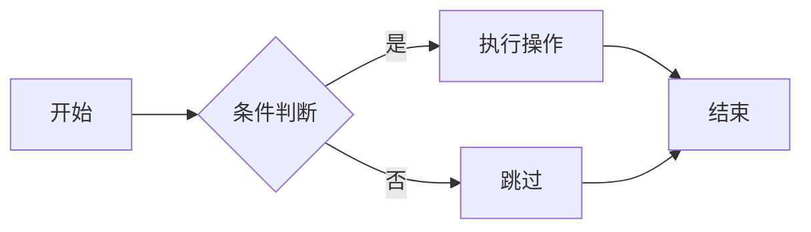
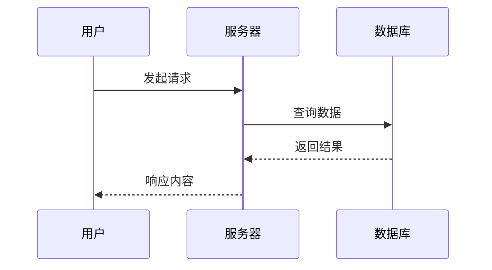
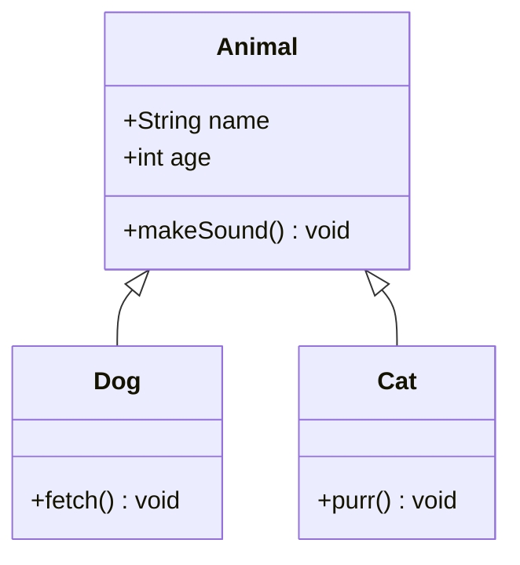
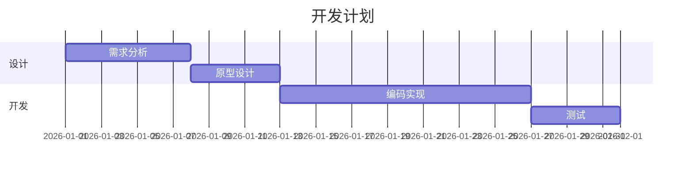
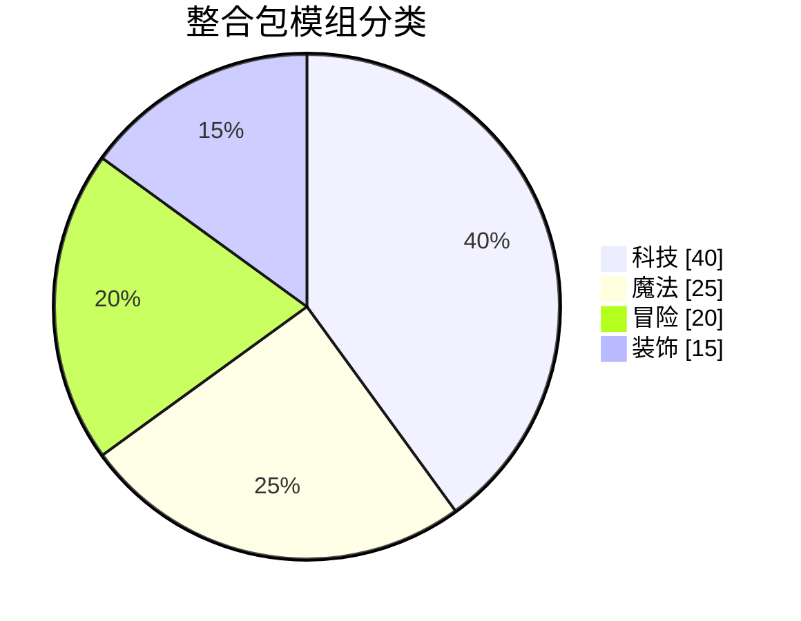

# Mermaid 图表示例

本页验证客户端 Mermaid 组件是否生效。代码块语言设为 `mermaid` 即可，图表在浏览器端渲染（无闪烁）。

## 流程图

```mermaid
flowchart LR
    A[开始] --> B{条件判断}
    B -- 是 --> C[执行操作]
    B -- 否 --> D[跳过]
    C --> E[结束]
    D --> E
```

## 时序图

```mermaid
sequenceDiagram
    participant U as 用户
    participant S as 服务器
    participant D as 数据库
    U->>S: 发起请求
    S->>D: 查询数据
    D-->>S: 返回结果
    S-->>U: 响应内容
```

## 类图

```mermaid
classDiagram
    class Animal {
        +String name
        +int age
        +makeSound() void
    }
    class Dog {
        +fetch() void
    }
    class Cat {
        +purr() void
    }
    Animal <|-- Dog
    Animal <|-- Cat
```

## 甘特图

```mermaid
gantt
    title 开发计划
    dateFormat  YYYY-MM-DD
    section 设计
    需求分析   :a1, 2026-01-01, 7d
    原型设计   :after a1, 5d
    section 开发
    编码实现   :2026-01-13, 14d
    测试       :5d
```

## 饼图

```mermaid
pie showData
    title 整合包模组分类
    "科技" : 40
    "魔法" : 25
    "冒险" : 20
    "装饰" : 15
```

如果你看到上面五张图被正常绘制成图形（而不是看到代码块原文），说明 Mermaid 插件工作正常。
