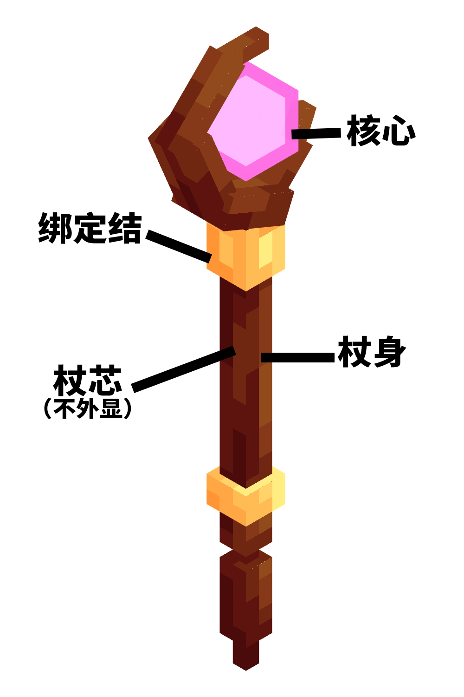

# 法杖

::: warning 法杖是什么？
本文所指之法杖，是一种较长的权杖型武器，也就是 Staff。在例如《哈利波特》中的细长棍状武器，一般被称作魔杖（wand）。  
目前有在考虑新增更多的施法工具，类似魔杖，魔导书，甚至魔铳。但目前阶段我们先只设计法杖。由于法术施放流程与法杖是分开维护的，所以后续新增的施法工具不会影响法杖的设计。
:::

法杖是法术的施法工具，所有法术（即候选槽法术选择 HUD）都必须且只能通过法杖释放。除此之外，法杖拥有基础的攻击形式，可以进行较弱的近战攻击，也可以释放基础远程攻击：魔弹。需要注意的是，法术的释放与魔弹攻击均消耗 1 点耐久，但是近战攻击需要消耗 2 点耐久。

如果没有特殊情况 / 法杖效果，则只有法术攻击需要消耗魔力，近战攻击和魔弹攻击不消耗魔力。  

法杖的合成、强化、拆解都可以在法杖装配台上实现。  

在技术上，法杖的所有属性、部件、效果都应当是数据驱动的，可以自由组合和扩展。

## 模块化设计

法杖采用模块化的设计理念，玩家可以自由组合并设计自己的法杖。已经制作完成的法杖可以进行进一步的强化，但无法更换部件。倘若不同部件之间的材料冲突，则可能会产生负面效果。 

### 属性

法杖共有 7 类属性和 3 个组合参数。属性整体上会受到材料的材料品阶属性影响，品阶越高，属性越高。法杖的属性如下：

- 耐久度
- 近战攻击力
- 魔弹伤害
- 法术强度
- 魔导效能
- 攻击速度
- 5 个流派亲和

其中，前四个是相对来说比较基础，与材料品阶呈正相关，但会根据材料属性有所偏向；流派亲和和魔导效能同样与材料品阶呈正相关，但其方差更为显著。攻击速度属性最为特殊，它不会受到材料品阶影响。

流派亲和、魔导效能和攻击速度三个属性倘若属于非中性区间，会在材料的 Tooltip 上显示；前两者的中性区间会根据材料品阶有所变化。

> 腐朽 - 魔导效能 - 洁净    
> 排斥 - 流派亲和 - 亲和   
> 沉重 - 攻击速度 - 轻盈     

因此，一个材料的标识应当如此显示：雪原遗骸 - 腐朽、轻盈、寒冰、神圣排斥

特别的，在《航迹》中，我们需要新增 暴击率 和 暴击伤害 属性。

此外，法杖还包括三个组合参数，即：
- **稳定度**：材料有（活跃 - 稳定）的属性，如果整体越稳定，则稳定度越高；稳定度越高，则攻击更高，输出更稳定；稳定度越低，法术强度与流派亲和有加成，但是耐久更低。
- **耦合度**：耦合度仅限于流派亲和，如果流派越统一，会对此流派额外加强；如果每个流派的数值越平均，耦合度越低，则会有全局加强。需要注意的是，耦合度的数值与材料品阶相关。
- **熟练度**：熟练度依据材料的组合最为合适，即一个材料最优秀的属性放在对应属性权重最高的部件槽；熟练度越高，会有全局加强，反之则有减益，并附带易碎法杖效果，近战消耗耐久更多。为补偿熟练度减益，熟练度低的法杖攻击输出不稳定，因此伤害拥有浮动区间，且在《航迹》中暴击率更高。

这三个组合参数会在法杖合成时判断。

### 部件

法杖由 4 个部件与 3 个符文槽组成，分别是：
- 杖身
- 核心
- 杖芯
- 绑定结

不同的部件有不同的属性权重，通过将材料的属性与属性权重结合，即可获得一个关于属性数值的自变量，将此变量与该属性的函数对应，即可获得最终属性。正常情况下普通属性默认使用线性或仿射函数，但保留函数计算接口，允许攻击速度、暴击率等需要特殊收益曲线的属性或复杂函数，也允许开发者自行设计计算公式。

需要注意的是，一个材料可以带有特殊属性，特殊属性与部件相关。可以无视部件的属性权重，直接增加自变量。

> 需要注意的是，只要把对应的材料放入相应的部件槽中即可，不需要专门制作部件。

## 材料

如果材料允许作为法杖配方，则必须继承`#允许部件`标签。

材料通过数据包添加以下属性与特殊属性，如果为空，则重置为默认属性：

- 材料品阶
- 耐久度
- 近战攻击力
- 魔弹伤害
- 法术强度
- 魔导效能
- 攻击速度
- 5 个流派亲和
- 活跃度

除了物品外，标签也可以设置属性，标签下的物品可以继承这些属性；特别的，如果物品本身也有属性标记，则以物品属性优先；倘若物品的不同标签标注了重复的属性，则采用更高的数值。

此外，材料拥有以下两个特殊效果：

- 附加属性：不与材料绑定，但允许通过物品组件附加到材料上；例如，窑炉可以生产洁净属性的材料，可以提升20% 魔导效能。特别的，附加属性可以约定为法杖效果
- 法杖效果：由材料 + 部件对应的法杖效果

## 法杖效果

法杖效果是由配方、材料+部件或其他内容提供的特殊被动效果，将会影响法杖的使用效果。
- 例如：使用古龙之心作为核心的法杖会拥有祝圣血脉的法杖效果，对于亡灵生物拥有击退效果，并会让亡灵生物燃烧

## 组合、强化与拆解

法杖的组合、强化与拆解都将会在法杖装配台上进行。法杖装配台会根据投入的物品自动变化 GUI：如果投入的物品可以用作核心，则会进入法杖装配界面、如果是法杖成品，则会进入强化界面；如果是受损法杖，则会进入法杖拆解界面。

如果均不是，则法杖装配台不会做出反应。

法杖属性的计算公式为：

$$
\begin{aligned}
\text{属性} &= \text{基础属性} \times \text{修正乘算} + \text{修正加算} \\[2pt]
\text{基础属性} &= \operatorname{fx}\left(\sum(\text{权重}\times(\text{数值}+\text{附加属性})) + \text{特殊属性}\right) \times \text{组合修正} \\[2pt]
\text{组合修正} &= 1 + \sum(\text{组合修正参数}) \\[2pt]
\text{修正乘算} &= 1 + \sum(\text{符文修正乘算},\ \text{附魔效果乘算}) \\[2pt]
\text{修正加算} &= \sum(\text{符文修正加算},\ \text{附魔效果加算})
\end{aligned}
$$

### 组合

法杖的组合比较简单，将所有材料放入对应槽位，即可合成法杖或查看对应属性和法杖效果。

- 如果法杖的组合符合一个指定的配方（允许标签），则可以合成对应的法杖。对应的法杖属性和法杖效果即可以由配方约定，也可以取决于材料本身的数值。
    - 对于法杖效果，可以设置是否屏蔽材料本身的效果

### 强化
法杖的强化分为两种，符文镶嵌与附魔。

符文镶嵌是法杖强化的重要方式之一。法杖通常可以镶嵌最多3个符文，玩家可以根据战斗需求选择合适的符文组合。符文主要分成两类卢恩文字符文与流派符文。卢恩文字符文主要用于强化法杖，提升效果。流派符文则可以添加对应法杖效果，将法杖的基础魔弹攻击转化为具有特定流派属性的魔弹。特别的，符文的效果是在法杖的基础属性上再进行额外增益。

附魔使用原版的机制，即在附魔台或铁砧上进行附魔。除了基础的附魔效果外，法杖还可以附加一些专属的法杖附魔效果，例如提升法术强度、减少法术消耗等。

### 拆解

耐久耗尽的法杖不会消失，而是会变成受损法杖，受损的法杖无法修复，但可以拆解出部分材料和装饰用途的纪念品。是否可以拆解出材料主要由标签约定，标签按照部件划分。正常情况下，部分符文和少量杖身可以被拆解出材料。

## 使用

左键：近战攻击/魔弹攻击（ALT键手动切换，或根据距离动态切换）  
右键：进入选择法术 HUD

魔弹攻击是法杖的基础攻击形式，通过发射魔力凝聚而成的魔弹来对敌人造成伤害。魔弹攻击不消耗魔力，但是会有短暂冷却时间。

## 美术效果

法杖使用晴路卡的模型库（SL0ANE/Loy-s-Goodies）中的 wand 模型改造，并根据材料形成独特的纹理。  
其中，杖身决定了法杖的整体形态和颜色，核心决定了法杖顶部聚能核心的颜色，绑定结决定了法杖绑定结的装饰形态。符文和杖芯不会影响法杖的外观。