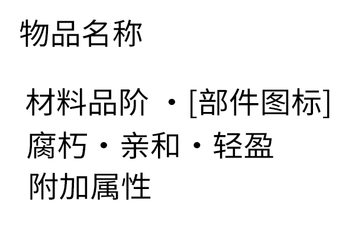

# 材料与部件

## 部件列表

法杖由 4 个部件组成，分别是：

- 杖身
- 核心
- 杖芯
- 绑定结

不同的部件有不同的属性权重，通过将材料的属性与属性权重结合，即可获得一个关于属性数值的自变量，将此变量与该属性的函数对应，即可获得最终属性。正常情况下普通属性默认使用线性或仿射函数，但保留函数计算接口，允许攻击速度、暴击率等需要特殊收益曲线的属性或复杂函数，也允许开发者自行设计计算公式。

需要注意的是，一个材料可以带有特殊属性，特殊属性与部件相关。可以无视部件的属性权重，直接增加自变量。

> 需要注意的是，只要把对应的材料放入相应的部件槽中即可，不需要专门制作部件。

## 部件属性权重

### 杖身

- 耐久度 0.6
- 近战攻击力 0.6
- 魔弹伤害 0
- 法术强度 0
- 魔导效能 0
- 攻击速度 0.7
- 流派亲和 0.1
- 暴击率 0.3
- 暴击伤害 0.1

### 核心

- 耐久度 0.1
- 近战攻击力 0.2
- 魔弹伤害 0.4
- 法术强度 0.6
- 魔导效能 0.4
- 攻击速度 0.1
- 流派亲和 0.4
- 暴击率 0.5
- 暴击伤害 0.4

### 杖芯

- 耐久度 0
- 近战攻击力 0
- 魔弹伤害 0.6
- 法术强度 0.3
- 魔导效能 0.6
- 攻击速度 0
- 流派亲和 0.4
- 暴击率 0.2
- 暴击伤害 0

### 绑定结

- 耐久度 0.3
- 近战攻击力 0.2
- 魔弹伤害 0
- 法术强度 0.1
- 魔导效能 0
- 攻击速度 0.2
- 流派亲和 0.1
- 暴击率 0
- 暴击伤害 0.5

## 材料

如果材料允许作为法杖配方，则必须继承`#允许对应部件`标签。

材料通过数据包添加以下属性与特殊属性，如果为空，则重置为默认属性：

- 材料品阶
- 耐久度
- 近战攻击力
- 魔弹伤害
- 法术强度
- 魔导效能
- 攻击速度
- 5 个流派亲和
- 活跃度

除了物品外，标签也可以设置属性，标签下的物品可以继承这些属性；特别的，如果物品本身也有属性标记，则以物品属性优先；倘若物品的不同标签标注了重复的属性，则采用更高的数值。特别的，对于活跃度、攻击速度，则采用更加接近中性的数值。

默认属性为：

法术强度、魔导效能和流派亲和的中性值已经确定为 0；它们的上限、曲线和材料品阶区间仍待原型测试后确定。

- 材料品阶 1
- 耐久度 132
- 近战攻击力 2
- 魔弹伤害 3
- 法术强度 0
- 魔导效能 0
- 攻击速度 50
- 5 个流派亲和 0
- 活跃度 50

## 材料品阶

材料的品阶可以提示玩家材料的性能和等级。在正常情况下，材料品阶越高，法杖的属性越高。在原版，最高的材料品阶为 5，但在内置的预设中，预设了 6 个材料品阶，以便航迹扩充。

## 特殊属性

材料的特殊属性与部件挂钩，当材料放置在合适的部件时，特殊属性会直接增加自变量，从而影响最终属性。特殊属性的数值可以为正数或负数，正数表示增加自变量，负数表示减少自变量。

## 附加属性

附加属性不与材料挂钩，但允许通过物品组件附加到材料上。附加属性受到部件属性权重的影响。当然，附加属性不一定是数值，也可以是法术效果，但不应该作为法杖配方。

## 示例

- 金锭 [ 可用部件：杖身、核心、绑定结 ]  
    - 材料品阶 2  
    - 耐久度 64  
    - 近战攻击力 4  
    - 魔弹伤害 8  
    - 法术强度 20  
    - 魔导效能 10  
    - 攻击速度 60  
    - 流派亲和：神圣 20；磐石 10 
    - 活跃度 35
- 特殊属性：  
    - 绑定：耐久度 +100
- 附加属性：
    - 祝圣：
        - 魔导效能 +10
        - 流派亲和：神圣 +30
- 法杖效果：
    - 绑定结：
        - 金属延展：近战攻击有 50% 概率不消耗耐久

## 美术效果

### 材料 Tooltip

- 默认状态：

按下 Shift 键后，列出所有数值和。特别的，若属性为默认值，则不显示对应属性。  
按下 Ctrl 键后，列出所有对应的法杖效果与特殊属性。
