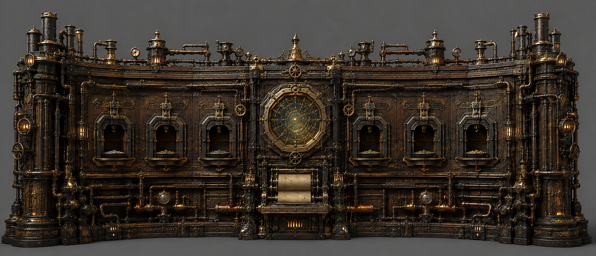
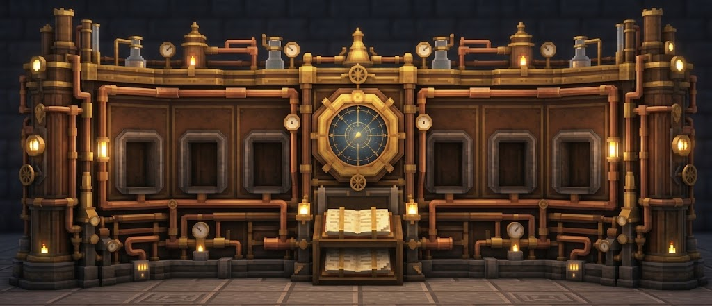

# 编纂仪

编纂仪（Codifier）是一个复杂的大型多方块结构，是进行法术研究的准入门槛。它是玩家从早期探索和小规模尝试进入正式法术研究所必须建造的核心多方块结构。编纂仪建成前，玩家通过探索、战斗和其他途径接触少量法术；编纂仪建成后，玩家可以按照配方系统稳定地合成法术。

编纂仪没有 GUI 界面，配方处理直接在多方块中交互，一次处理一份配方。配方装填完成后，机器会检查输入内容，并输出对应的法术卷轴。同一配方可以重复执行并重复产出法术卷轴。

## 基本结构

编纂仪是一个 **7 格宽 × 2 格深 × 3 格高** 的多方块结构，灵感来源于小型机 PDP-7。机器横向展开，主体由两侧翼板和中央反应区域组成。

其形式如下：

```text
+---------------+
| - x x x x x - |
| x - - - - - x |
+---------------+
```

三层结构一致，其中，“-”为空气方块，“x”为多方块结构的组成方块。中央的 1 * 2 区域为核心反应区，其余则是两侧翼板之间。

编纂仪拥有以下槽位：
- **核心槽**：1 个，用于放置配方要求的核心内容，一般为源质化的抽象元素材料；
- **试剂槽**：共 6 个，分为普通试剂槽 4 个和特殊试剂槽 2 个。
- **书页槽**：1 个，用于放置消耗品奥术书页。

### 核心槽

核心槽位于机器正中央的观察窗内，用于放置配方要求的核心材料。核心材料一般是通用材料，取决于法术的稀有度和法术流派。

观察窗带有可开合的玻璃罩。玻璃罩打开时，机器处于待机状态；材料装填完成后，关闭玻璃罩，编纂仪开始检查配方。

### 普通试剂槽

六个试剂槽中，外侧的四个为普通试剂槽，用于放置配方所需的普通材料。四个普通试剂槽彼此无序，材料满足配方要求即可，投入顺序不影响匹配。

### 特殊试剂槽

六个试剂槽中，靠近中央的两个为特殊试剂槽，用于放置配方指定的特殊材料。两个特殊试剂槽彼此无序，但材料必须符合特殊材料要求。

因此，一份法术配方最多可以包含：

```text
1 个核心材料 + 4 个普通材料 + 2 个特殊材料
```

如果配方不需要特殊材料，则两个特殊试剂槽则没有特殊要求，与普通试剂槽通用。

### 奥术书页（暂命名）

核心材料槽下方设有书页输入机构，用于放置消耗品 **奥术书页**。奥术书页是启动一次编纂所需的记录介质，并在配方完成后消耗。

编纂完成后，法术卷轴从同一机构中输出。

## 配方与编纂

编纂仪采用有序槽位和无序槽位结合的匹配规则：核心材料必须放入核心槽；其余材料放入试剂槽位，如有特殊材料要求，则必须放入特殊试剂槽。编纂仪要求配方完全匹配，只有输入材料的种类与配方要求完全一致，配方才能执行。

编纂流程如下：

```text
观察窗打开时
→ 放入核心材料、普通材料、特殊材料和奥术书页
→ 关闭观察窗
→ 检查配方
→ 执行编纂
→ 输出法术卷轴
```

配方不合法时，机器显示错误状态并重新打开观察窗，不消耗已放入的材料。配方合法时，机器执行一次编纂动画，完成后输出法术卷轴。

法术卷轴是编纂仪的标准产物。具体法术的获取条件和配方决定其是否可以通过编纂仪获得；探索、战斗、任务和法术精进构成其他法术获取途径。

## 技术


## 美术

编纂仪是一台横向展开的巨型文艺复兴炼金机械，主体尺寸为 7 格宽、2 格深、3 格高。整体由一个完整柜体构成，两侧翼板略向前展开，中央设有核心观察窗。

主体形式类似于 PDP-7 为代表的早期小型机。以深色雕刻木材、金属框架、紫铜部件组成。齿轮、压力阀、传动杆和管道部分外露在主体表面，整体保持厚重的柜体轮廓。

正面横向排列 6 个方形试剂孔，外侧四个对应普通材料，靠近中央的两个对应特殊材料。每个试剂孔带有简洁的承接槽和锁紧结构。中央观察窗使用厚玻璃和旋转黄铜环，内部显示核心材料的反应状态。

观察窗下方设置书页输入和卷轴输出机构，采用短距离送料、压印和推出动作表现法术编纂。机器运行时，管道输送材料，齿轮和传动杆运动，中央环形结构旋转；完成后，法术卷轴从下方机构推出。

整体美术表现为一台完整的发条炼金机械，采用统一的柜体、传动和管道结构。运行状态以炉火、管道荧光、玻璃内反应和机械动作作为主要反馈。

### 例图



