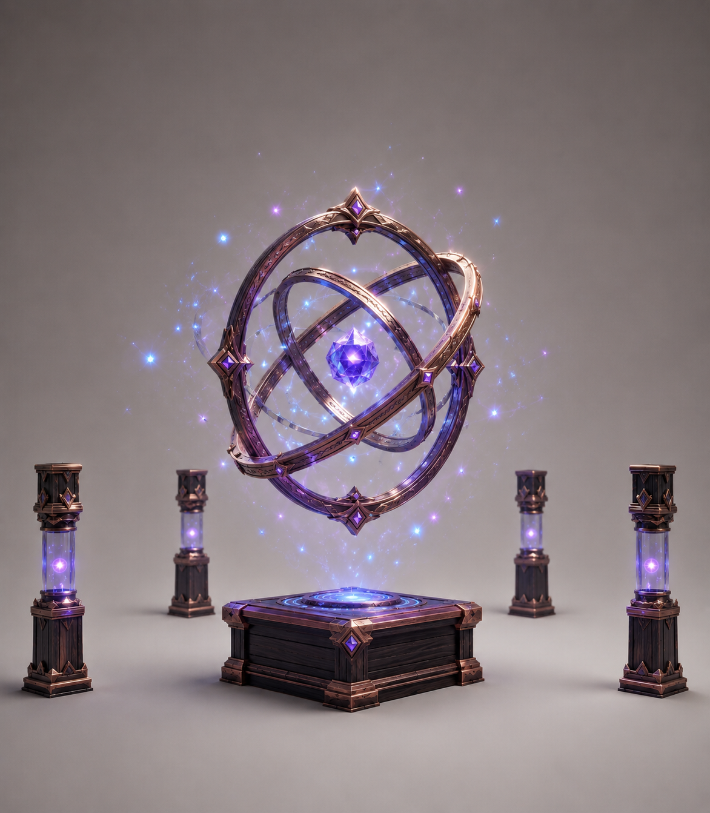

# 蕴仪

::: warning
相关内容与设计未完善，可能会随时更改，请谨慎参考。
:::

蕴仪（Imbuer）是一台从中期开始使用，能够使材料蕴化的进阶材料处理工作方块。通过蕴仪，可以让材料充盈、活化或精华化。蕴仪不生产或储存可以供其他设备使用的魔力，也不需要燃料或额外的辅助材料。放入能够蕴化的材料后，仪器便会自动缓慢完成转化，其主要用于生产法杖、符文、符卡及其他高级工艺所需的抽象源质材料。

蕴仪类似于末地水晶，只有需要放置在底座上才能运转。

蕴仪采用拟物化 GUI，并通过圆环的运转和流离的魔力粒子表现蕴化过程。

## 基本结构

蕴仪包含以下槽位：

- **输入槽**：用于放置可以进行蕴化的材料，1 个；
- **产物槽**：用于存放完成蕴化的材料，1 个。

此外，蕴仪拥有一条蕴化进度，用于表示当前材料吸收环境活性的程度。

蕴仪不使用燃料，也不拥有能够抽取或输出的魔力容器。只要输入材料有效、产物槽能够接收产物，蕴仪便会自动开始工作。

### 输入与蕴化

蕴仪处理的是材料状态的转变，一份蕴化配方通常只包含输入材料、产物和蕴化时间：

```text
输入材料 + 蕴化时间 → 蕴化产物
```

蕴化主要包括以下三类变化：

- **充盈**：使原本空白或匮乏的载体逐渐充满魔力；
- **活化**：使惰性的魔法组件转变为能够参与后续工艺的活性组件；
- **精华化**：使符合条件的材料转变为抽象的精华或源质材料。

蕴仪只处理配方明确允许的材料，不会凭空生成紫铜、乌木、硫、汞等具体资源，也不会直接生产完整的符文、符卡或法杖。蕴化产物主要作为后续配方的通用材料或法杖组件。

### 自动运行

蕴仪的运行不需要玩家手动启动。当输入材料匹配蕴化配方时，仪器会自动积累蕴化进度，并在达到配方要求后消耗输入材料、输出对应产物。

当输入材料不足、产物槽无法接收产物，或当前材料没有对应配方时，蕴仪会暂停运行。条件恢复后，仪器自动继续工作。

蕴仪的基础运行速度较慢，以等待时间作为几乎不消耗额外原料的代价。它适合持续生产通用源质材料，而不用于快速处理大量普通资源。

### 导引设备

蕴仪附近可以放置若干导引设备，以此提高蕴化速度。导引设备被称之为**导引柱**（Inductor）。每有一个导引柱，蕴仪的运行速度会获得一定加成。没有导引设备时，蕴仪仍然能够以基础速度运行；在有效范围内放置导引设备后，蕴仪会自动识别并获得速度提升。导引柱的数量上限为 6 个，最性价比数量是 4 个。

导引柱和蕴化速度的关系如下：

- 0 个导引柱：100%
- 1 个导引柱：125%
- 2 个导引柱：150%
- 3 个导引柱：200%
- 4 个导引柱：250%
- 5 个导引柱：275%
- 6 个导引柱：300%

每根导引柱同时只能连接一台蕴仪。

## 技术

## 美术

蕴仪是一个约两格高的悬浮式仪器，由底座方块和上方的蕴仪主体组成。它是整套工作方块中最具魔幻感的设备，整体结构大部分保持开放，以中央浮空的浑仪结构作为主要视觉中心。

底座只承担承托和稳定作用，由乌木底座和金属包边组成；浑仪完全由金属构成，悬浮在空中，与底座之间没有可见的支撑结构。

### 底座

蕴仪底部为低矮、完整、稳定的乌木底座，边缘使用紫铜包边。底座不需要过高，也不应占据设备的大部分体积，它主要用于提供视觉重量。

### 浑仪

浑仪是蕴仪的核心部分，由三条相互交错的金属环组成。三条金属环具有不同的旋转轴，可以独立转动。

- 外层金属环负责维持浑仪的整体结构；
- 中层金属环与外环交错排列，形成复杂的空间关系；
- 最内层金属环围绕中央合成物，用于表现材料状态的稳定和转化。

合成物位于最内部的中心位置，完全浮空，不使用支架、容器、连接杆或其他可见的承托结构。浑仪整体也不与底座接触，保持独立的悬浮状态。

浑仪的金属环应当具有一定厚度和完整性，不能做成过于纤细、容易断裂的线圈，金属环要求浑然一体。

### 导引柱

导引柱是单独的瘦长方块。导引柱采用纵向分层结构，采用三段式，分别是：
- 顶部的乌木柱头，带有金属包边
- 中间的玻璃结构
- 底部的乌木柱脚，带有金属包边

### 运行反馈

蕴仪运行时，浑仪会上下轻微浮动。三条金属环会以不同方向缓慢转动，中央合成物保持悬浮，跟随金属环移动。

基础运行效果以蓝色粒子为主，蓝色粒子在金属环四周游离飘荡，部分粒子向中央合成物汇聚；当周围存在导引柱时，会出现紫色粒子，其特性和蓝色粒子一样。导引柱越多，紫色粒子越多，整体运行效果越明显。

当蕴仪没有放置材料，或当前材料无法进行蕴化时，三条金属环停止，蓝色粒子逐渐减少并消散

### 整体美术效果
蕴仪最终应当呈现为一台：

> 由乌木与金属包边底座、完全浮空的三环浑仪、中央悬浮合成物和可独立放置的导引柱组成的魔法工作设备。

它的主体结构保持开放，底座提供稳定感，浑仪提供魔幻感，蓝色粒子表现基础蕴化，紫色粒子表现导引柱引入的外部魔力。

### 例图

