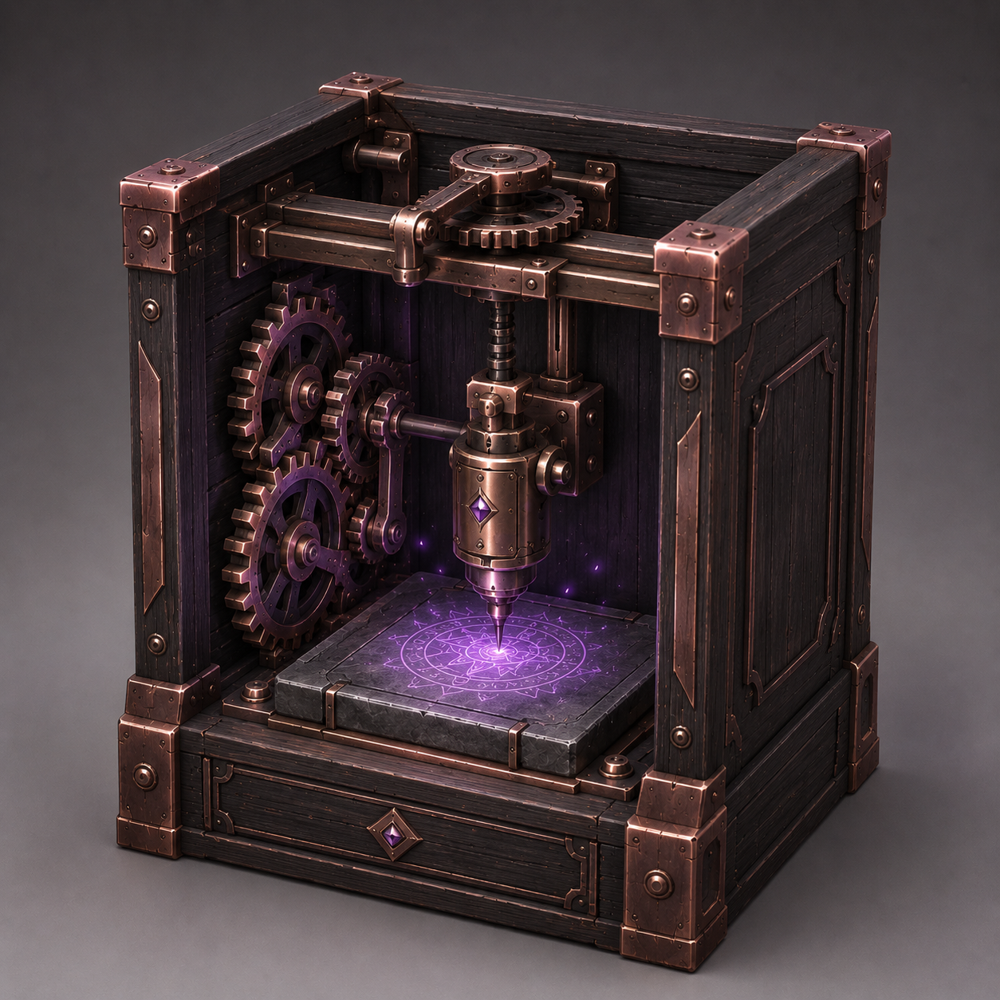

# 铭刻仪

铭刻仪（Inscriber）是一台进阶合成工作方块，用于将图纹铭刻在载体上，赋予材料新的特性。它主要负责符文合成、符卡制作，以及部分特殊材料的合成。

铭刻仪的核心体验是快速、稳定和可重复的自动生产，并不要求玩家进行绘制图案或其他复杂的沉浸式操作。

铭刻仪采用拟物化 GUI 和运行时齿轮转动的动画效果。

## 基本结构

铭刻仪包含以下槽位：
- **模具槽**：用于放置木制、泥制或金属模具。模具决定铭刻的图纹，并拥有有限耐久
- **消耗物槽**：共 3 个，每个槽位可以放置一种不同的材料。每个槽位的容量为 1B，或 1 组堆叠物品。
- **铭刻物槽**：用于放置承受铭刻的载体，例如石板、符文胚或其他特殊材料；
- **燃料槽**：用于放置岩浆等燃料，容量为 4B；
- **产物槽**：用于存放铭刻完成后的产物，1 个

### 模具和铭刻

模具类似于锻造模板，是铭刻仪的核心生产部件，其可以被反复使用，但拥有有限耐久。

模具的材质决定其耐久：

- **木制模具**：耐久 3，适合早期试制和单次铭刻；
- **泥制模具**：耐久 32，适合中期的有限批量生产；
- **金属模具**：耐久 128，适合长期生产和自动化运行。

模具有着具体的配方信息，决定铭刻仪的产物和配方。模具的材质只决定模具的耐久，不影响配方和产物。相同图纹可以分别制作木制、泥制和金属模具，例如木制治疗术模具、泥制治疗术模具和金属治疗术模具。

### 输入和配方

当放入燃料后，铭刻仪会检查当前模具、铭刻物和消耗物是否匹配唯一配方。若匹配成功，则铭刻仪会消耗燃料并开始运行，经过配方规定的时间后完成一次铭刻，并输出产物。铭刻仪会始终自动运行，直到材料耗尽、产出槽满或配方不匹配。不符合配方时，机器保持停止状态，不会消耗任何材料。

一个配方通常包含：

```text
模具图纹 + 铭刻物 + 消耗物 + 铭刻时间
```

正常情况下，一个配方最多使用两种消耗物，而不需要使用第三个消耗物槽位。不鼓励让同一配方依赖过多材料，以减少配方重叠和机器状态的不确定性。

消耗物的检测采用宽松配方匹配，只要消耗物中的材料能够满足目标配方的要求，铭刻仪就会消耗对应数量的材料进行铭刻。但是，如果消耗物槽的材料会导致多个配方匹配，则铭刻仪会判定为配方冲突并停止运行。冲突状态需要在 GUI 中显示具体原因，使玩家能够调整模具、铭刻物或消耗物。

铭刻仪使用岩浆作为主要驱动燃料，燃料槽容量为 4B。仪器运行时，每 60 tick 消耗 5mb 燃料


## 技术


## 美术

::: warning 早期设计
目前的铭刻仪设计是早期的概念设计，很多内容尚不合理
:::  

### 整体美术效果

铭刻仪是一个饱满而精密的单方块设备，是一个由机械与齿轮驱动的自动化雕刻机械。

整体是两面开口的乌木柜式结构，开口内设置工作腔，包括铭刻物槽和铭刻头等。紫铜齿轮和操作机构附着在柜体内部，与铭刻头形成明确的传动关系。

主体材料由紫铜、乌木组成。

### 柜体

铭刻仪的主体是一个标准的方形方块。乌木柜体表面可以使用紫铜包边、铆钉等纹理细节。铭刻仪两侧设置贴合柜体内部的紫铜齿轮与关节，齿轮组不需要过度复杂，但应当让玩家能够理解其和铭刻头具有传动关系。这些机械结构不应大面积突出方块边界。

柜体底部拥有约 3 像素的实心底座，其余部分镂空，正面和顶面开口，作为半封闭的铭刻工作腔，两侧柜板、后侧柜板均保留。工作腔下方的实心底座设置平整的石质刻台，用于固定铭刻物。

刻台底座上会显示放置的铭刻物。放置铭刻物时，刻台底座会被填充（固定模型），并向上突出约 1 像素。

### 铭刻头

铭刻头是铭刻仪最主要的视觉部件，表现雕刻动作。铭刻头悬挂在工作腔上方，由以下结构组成：

- 刻头本体，包括刻针、关节和刻头仓体
- 连接上方偏心轮、滑轨和悬挂支架的传动结构

在静止状态下，铭刻头竖直静置，贴近铭刻物表面。

### 运行反馈

当铭刻仪运行时，首先表现为机械结构的连续运动：
- 两侧紫铜齿轮缓慢转动
- 铭刻头缓慢移动，进行雕刻动作

在铭刻过程中，铭刻物会迸发出紫色粒子效果，铭刻物上会出现固定的发光纹理效果。

当铭刻仪放置有铭刻物时，刻台底座上会显示放置的铭刻物，并往上突出 1 像素。

### 整体印象

铭刻仪最终应当呈现为一台：
> 由厚重乌木柜体、紫铜齿轮和铭刻头组成的自动化魔法雕刻设备。

### 例图

::: warning 
铭刻头和内部的齿轮组有很大的问题，看看得了
:::


