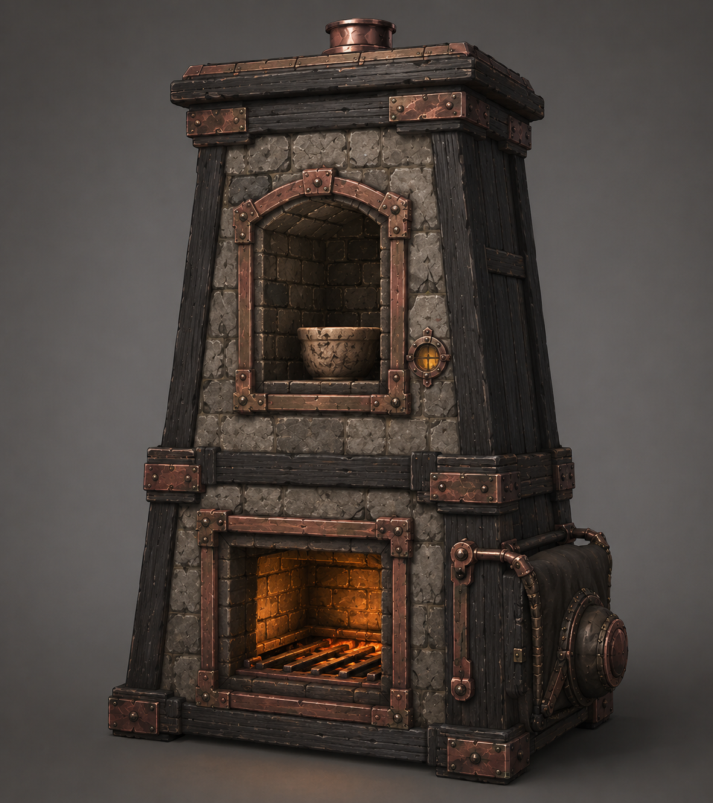
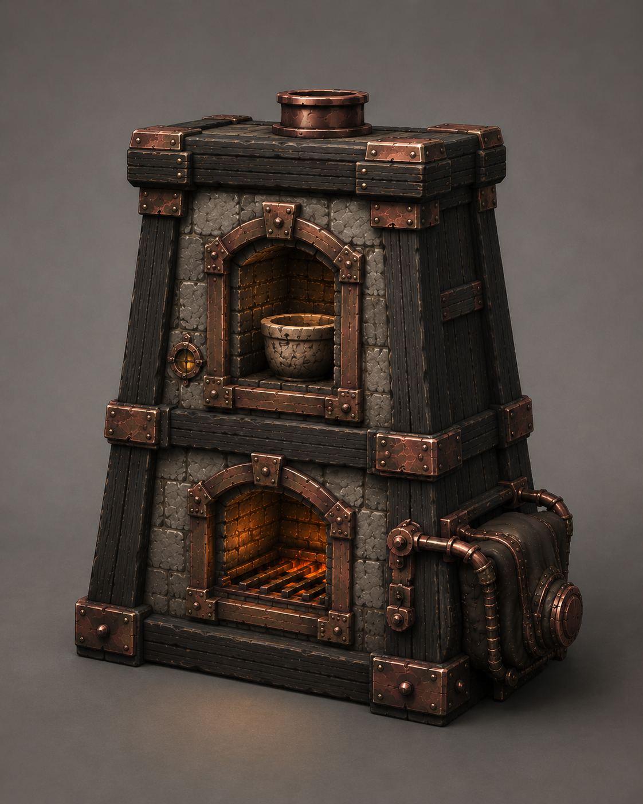
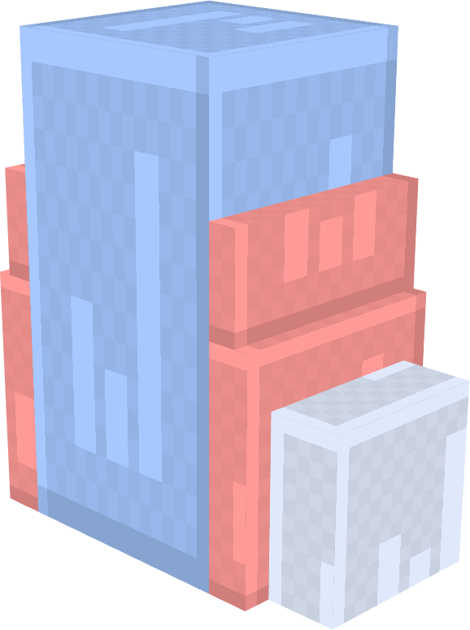

# 窑炉

窑炉（Kiln）是贯穿游戏进程、从早期一直使用到后期的**材料处理工作方块**，用于冶炼、熔炼粗矿，以及融合不同的固体材料。窑炉是一个主体为 1 * 2 的多方块结构，由下方的熔炉和上方的窑室组成，并可以通过安装插件逐步解锁新的配方，获得新的能力。

窑炉拥有拟物化的 GUI 和冶炼的动画效果，但相较于蒸馏器，窑炉的GUI更加规整。

## 基本结构

### 多方块与插件

窑炉本体由下方的熔炉和上方的窑室组成。基础结构包含以下部分：
- 1 个燃料槽位；
- 2 个基础输入槽位；
- 2 个产物槽位；
- 4 个插件槽位。

安装坩埚插件后，窑炉额外获得 2 个输入槽位，输入槽位总数增加至 4 个。

窑炉拥有五个插件，各自承担不同的扩展方向，但是窑炉本身最多只能安装四个：
- **风箱**：强化部分配方的产出能力，使指定产物能够倍产；
- **观察窗**：允许窑炉处理不稳定材料，拓展新的配方。
- **坩埚**：增加 2 个输入槽位，允许执行需要更多材料的融合配方；
- **炉栅**：改善材料的受热和分离过程，允许产出具有纯净性质的材料。
- **耐火炉衬**：减少熔炼过程中的燃料消耗，加快熔炼速度

插件分为两类：一类解锁原本无法执行的配方，另一类改变已有配方的产出或处理效果。基础窑炉仍然可以执行不依赖插件的配方；完整窑炉则拥有最完整的配方和处理能力。

窑炉的结构示意如下：

```text
x窗x
x窑+坩x
x熔+栅风
```

其中熔炉和窑室组成窑炉主体，观察窗、坩埚、炉栅和风箱分别安装在指定位置。插件既可以手持放置在对应位置，也可以进入 GUI 进行放置和取出。

### 配方与熔炼

窑炉要求配方完全匹配，只有输入材料的种类与配方要求完全一致，配方才能执行。窑炉采用无序合成。

配方可以要求一个或多个指定插件。缺少必要插件时，即使输入材料完全匹配，窑炉也不会开始熔炼。风箱等功能型插件对产量或处理结果的影响，由具体配方决定。

窑炉使用燃料进行熔炼，具体燃料效率、处理时间、产物数量和不稳定材料规则由配方和插件能力决定。产物进入产物槽，产物槽无法接收时，窑炉暂停当前熔炼过程。

## 技术

## 美术

### 整体美术效果

窑炉由石制炉体、乌木外框和部分金属控制部件组成，是一个 1×2 的纵向多方块结构。下方为燃烧室，上方为窑室。两个部分应当有连续的承重结构和明确的中央轴线，上下结构不能像两个独立方块简单叠放。

整体轮廓建议略微向外扩张，形成沉重、稳定的梯形斜面炉体，以保持视觉稳定性。石料组成了窑炉绝大部分的主体，乌木用于外框、支架和侧面护板，紫铜用于炉门边缘、炉栅、风箱连接和固定件等部件。

燃烧室正面设有炉膛开口，用于表现燃料燃烧。窑室正面设有窑门开口，。两个开口应当处于统一的正面结构中，并通过厚重边框和金属固定件保持整体感。


### 插件

窑炉共有 5 个插件，分别是风箱、观察窗、坩埚、炉栅和耐火炉衬。插件会改变窑炉的局部外观和运行反馈，但不会改变窑炉的整体轮廓。

- **风箱**：位于窑炉右侧，由皮革、乌木和紫铜风管组成。运行时风箱进行缓慢的收缩和复位动作。
- **观察窗**：位于窑炉正面，由厚玻璃和紫铜固定环组成。
- **坩埚**：显示在窑室内部，是一个小型石质或陶质容器。
- **炉栅**：由金属制成，位于燃烧室内部，用于支撑燃料和改善受热过程。安装后可以在炉膛开口处看到栅格结构。
- **耐火炉衬**：位于窑室内壁，安装后会增加一层厚重的深色耐火内衬。

### 运行反馈

窑炉运行时，燃烧室显示火焰、热光和少量烟雾粒子；窑室可以显示少量蒸汽或热气粒子。动态效果应当保持低频和简洁，重点表现窑炉正在运行，而不是持续制造大量粒子。

安装风箱后，风箱进行缓慢的收缩动作，燃烧室的火焰变得更加活跃。

### 例图

> 一个高了一个矮了



