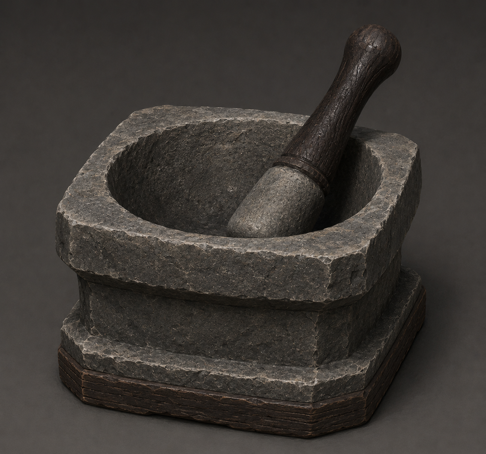

# 研钵

研钵（Mortar）是最简单也是最基础的**材料处理工作方块**，通过研磨将材料研磨为粉末、浆液等便于后续加工的形态，也可以完成少量直观的混合研磨。研钵的合成应当简单迅速，强调玩家的直接操作：投入材料、执行研磨、立即获得产物。

## 基本结构

### 输入与合成

研钵没有 GUI 界面，玩家可以通过右键方块直接处理材料。手持材料时，将材料右键放入研钵，会在研钵上方显示当前材料的图标和数量。研钵最多容纳四种不同的材料类型，每种材料类型的上限为 1 组。当研钵达到材料种类上限，或对应材料达到容量上限时，拒绝继续投入。

四种材料类型用于保留未来的配方拓展空间，并不要求早期配方使用全部容量。早期内容以单材料和双材料配方为主，后续可以加入三种或四种材料的混合研磨配方。

空手 Shift 右键研钵时，取出其中尚未消耗的全部材料。取出操作不会产生副产物，也不会消耗材料。

### 交互和配方

研钵根据方块实体中的容量进行匹配，当且仅当研钵中的配方所需材料完全匹配时，合成才能进行。相较于工作台合成，研钵合成产物会更多。例如一份甘蔗可以合成 2 份糖而非原版工作台的 1 份。

空手右键研钵时，执行一次当前匹配的配方：

- 消耗配方规定数量的输入材料；
- 生成配方规定数量的产物；
- 播放研磨音效，并显示简短的粒子或动作反馈。
- 产物直接掉落在研钵上方；

一次操作只执行一次配方，研钵的产物直接掉落。若研钵中仍然有足够材料，玩家可以再次空手右键继续研磨。

如果玩家想要连续执行配方，可以通过空手长按右键进行“蓄力研磨”，这一过程中，研钵会以 每 20 tick 并逐渐加快到 每 10 tick 一次合成的速度执行当前匹配的配方，直到研钵中材料不足或玩家松开右键为止。

> 研钵没有自动化能力，需要玩家手动操作

## 技术

## 美术

### 整体美术效果

研钵整体是一个类似碗的石质方块，由研磨槽和研磨臼两部分组成。研磨槽完全由石料构成，研磨臼由石质臼头和乌木手柄组成。玩家看到研钵时，第一印象应当是一件简单、厚重、清晰的传统石制工坊工具。

研钵的整体轮廓接近方形，内部向下收拢为碗状研磨槽。石料占据绝大部分体积，乌木主要用于研磨臼的手柄。

### 运行反馈

当研钵中有材料时，研磨槽内部显示最近投入的材料；研钵上方可以简洁悬浮显示当前已投入的材料图标和数量。

执行研磨时，研磨臼以 90 度为单位进行一次短促旋转，并在动作结束后回到初始位置。研磨过程中播放研磨音效，并产生少量材料粒子效果。

模组[更好的研钵](https://www.mcmod.cn/class/1810.html)的设计可以作为造型和交互表现的参考。

### 例图

