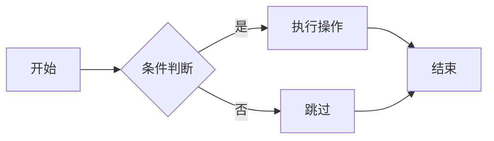
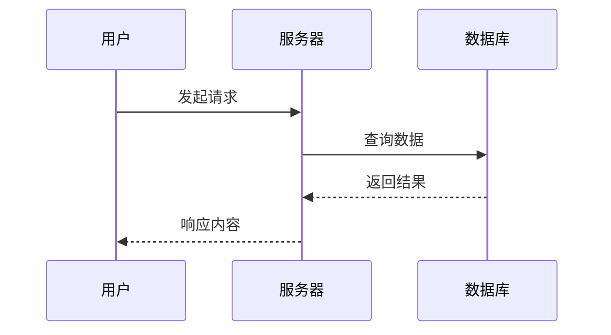
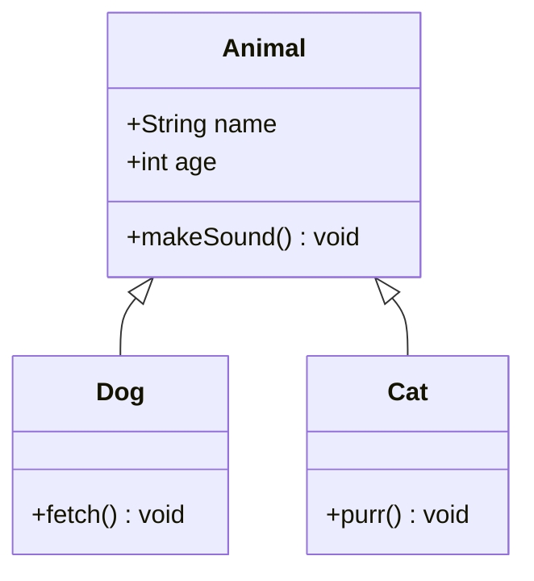
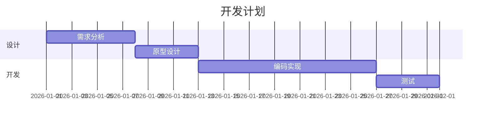
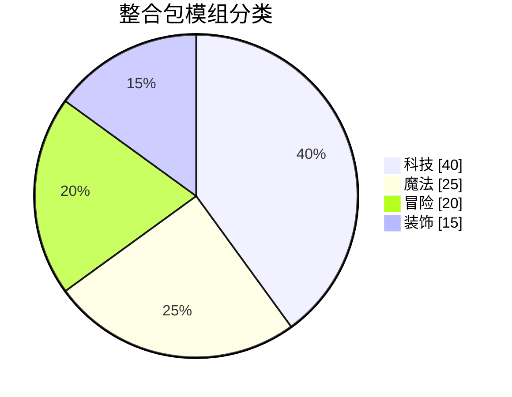

# Mermaid 与 LaTeX

文档支持 Mermaid 图表和 LaTeX。LaTeX 公式依赖 KaTeX 插件。

## Mermaid 图表

Mermaid 图表使用 ` ``` ` 三个反引号组成的代码块包裹，并将语言标记为 `mermaid`。图表包含多种类型，包括流程图、时序图、类图、甘特图、饼图等。以下提供了一些 Mermaid 图表的示例以供参考。

### 流程图



### 时序图



### 类图



### 甘特图



### 饼图



## LaTeX 公式

LaTeX 公式的书写方式与 Markdown 中的行内公式和块级公式相同，分别使用 `$...$` 和 `$$...$$` 包裹。可以查看 [KaTeX 官方文档](https://katex.org/docs/supported.html) 了解更多支持的语法，或使用 AI 工具生成。

以下提供了一些 LaTeX 公式的示例，以供参考。

### 行内公式

当 $a \ne 0$ 时，方程 $ax^2 + bx + c = 0$ 的解为：

### 块级公式

$$
x = \frac{-b \pm \sqrt{b^2 - 4ac}}{2a}
$$

### 矩阵

$$
\begin{bmatrix}
1 & 2 & 3 \\
4 & 5 & 6 \\
7 & 8 & 9
\end{bmatrix}
\cdot
\begin{pmatrix}
x_1 \\ x_2 \\ x_3
\end{pmatrix}
=
\begin{pmatrix}
14 \\ 32 \\ 50
\end{pmatrix}
$$

话说我们真的会用到这么多公式吗？