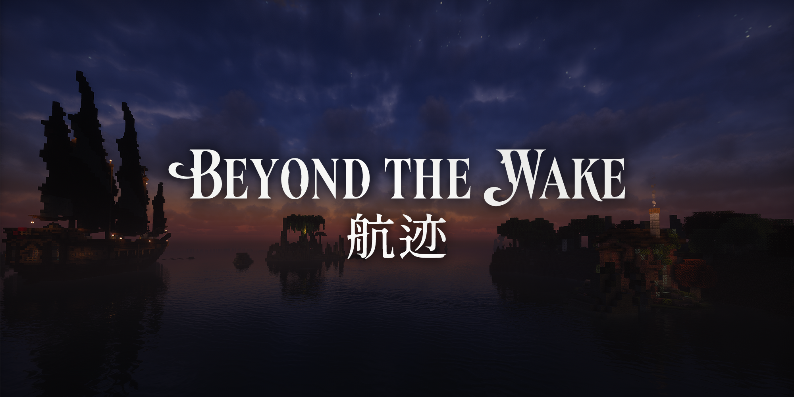

# 项目概览

「航迹 · Beyond The Wake」是一款以海岛为背景的大型剧情向魔法冒险整合包。在地理大发现时代的架空魔法世界中，你将作为一名新晋探险家踏入黎明群岛，领略一个崭新的群岛世界。征服广袤海洋，发现失落遗迹，学习法术，构筑顿悟，收集遗珍，并在一次次冒险中逐渐揭开群岛深处隐藏的秘密。

这是一款成长驱动型 RPG 整合包，以法术构筑与策略战斗为核心，由群岛世界与原创剧情塑造冒险体验。通过模块化成长与丰富的支线内容，为角色带来长期而持续的成长。

## 整合包信息

| 项目   | 内容                        |
| ---- | ------------------------- |
| 类型   | 魔法 · RPG · 冒险 · 剧情        |
| 版本   | Minecraft 1.21.1 NeoForge |
| 玩家人数 | 单人 / 单队伍                  |
| 推荐时长 | 60h                      |
| 难度   | 中难度                       |
| 核心体验 | 探索、成长、构筑、战斗、剧情            |

## 游戏特色

### 策略导向的动态法术战斗

「航迹」围绕原创法术系统重新设计了 Minecraft 的战斗体验。我们摒弃了传统固定技能槽冷却模式，设计了侧重游戏的策略性与动态选择的动态战斗体系：
- **随机法术卡组**：玩家搭配已解锁的法术形成法术卡组，在战斗中仅有4个随机法术会进入候选槽。通过合理的法术搭配与实时决策，才能在战斗中占据优势。
- **双轨魔力系统**：拥有稳态魔力与涌态魔力两种魔力，稳态魔力可以自然恢复，涌态魔力则需要通过攻击或受击来补充；配合允许超限施法的魔力超载机制，迫使玩家在资源管理上做出取舍
- **积势系统**：为了限制玩家过度依赖某些强力法术，释放高级法术需要消耗积势，积势会对法术的威力和效果产生显著影响，玩家需要在战斗中权衡积势的使用与积累。
- **能力系统**：独立冷却的辅助技能，提供额外战术维度

玩家需要根据实时资源与战场情况进行决策，考验即时决策与资源取舍，而非依赖固定循环与技能连招。
### 自由构筑属于你的成长路线

成长始终是「航迹」的核心驱动力，我们设计了一套模块化构筑系统「顿悟」：
- **选择模块**：技能树由许多独立的模块组成，玩家可以自由选择模块组合，形成独特的成长路线
- **点亮心得**：消耗资源点亮模块中的节点，实现数值与能力的逐步积累
- **决定顿悟**：当模块中的心得全部点亮，玩家将有机会抉择新的顿悟，带来机制性突破

围绕法术、顿悟、装备与饰品自由组合构筑，我们希望每位玩家都能围绕自己喜欢的流派不断尝试新的组合，在不断成长中形成独属于自己的战斗风格。
### 原创世界与沉浸式叙事

「航迹」希望突破 Minecraft 整合包传统的任务驱动式冒险体验，通过原创模组、任务日志与实机演出，塑造一个围绕成长、战斗与探索展开的魔法 RPG 世界。
- **剧情导向的任务日志**：放弃传统的 FTBQ 任务视图，以原创任务日志系统引导探索与剧情推进
- **沉浸式的剧情演出**：借助相机大师、NPC 与对话框，在 Minecraft 中实现真正的剧情演出。
- **原创章节内容**：每个章节拥有独立的地图、Boss、玩法与故事，形成完整的冒险体验。
- **内容驱动的成长与冒险**：不采用动态等级系统，玩家的挑战来自探索、战斗与剧情，而非怪物数值自动缩放。
### 群岛世界中的冒险

广阔的海洋连结又分隔着世界，带来独特的探索体验。「航迹」并不希望打造一款航海模拟游戏，而是让海洋成为连接冒险的纽带，而非阻碍冒险的距离。
- **经营你的舰队**：舰队作为玩家的远程基地，承担仓储、商队、功能扩展等后勤职责
- **穿梭于无尽之海**：航线连接各个重要港口与聚落，通过航线系统，在港口之间快速穿梭，在保留探索感的同时，大幅减少重复航行带来的枯燥体验
- **丰富的海洋生态**：「航迹」精心设计了一个漂亮的海洋世界。体验新的群系、新的生物、新的故事